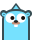

# amisgo-assets

## Logo Attribution

The amisgo logo is a derivative work based on the Go gopher favicon:

- Original SVG source: [golang/website](https://github.com/golang/website/blob/3a761022ad6ff0280a444482b7c8deb56f0ab372/_content/doc/gopher/favicon.svg)
- The Go gopher was designed by [Renee French](https://reneefrench.blogspot.com/)

## License

This work is licensed under 

- Share — copy and redistribute the material in any medium or format
- Adapt — remix, transform, and build upon the material
- Attribution — You must give appropriate credit
- NonCommercial — You may not use the material for commercial purposes
- ShareAlike — If you remix, transform, or build upon the material, you must distribute your contributions under the same license as the original
